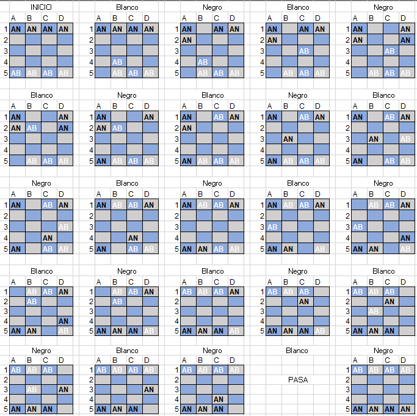

# Ensayo sobre la Introspección y la Resolución de los Alfiles en el ajedrez

## Por: Calderón Piña Carlos Michell

### Introducción

La introspección, derivada del latín "introspicere" que significa "mirar en el interior", es un concepto fundamental en la comprensión de la mente humana. Esta se refiere a la capacidad de un individuo para observar y analizar sus propios estados mentales, lo que implica interpretar y caracterizar sus procesos cognitivos y emotivos. En este ensayo, exploraremos la introspección y luego se abarcará el desafío de resolver un problema del alfil de ajedrez específico que requiere un enfoque estratégico y analítico.

Entonces como anteriormente se hizo la pregunta, ¿Realmente que es que la Introspección? Esta no es más que un Viaje al Interior de la Mente
La introspección se rige como una herramienta invaluable para comprender la complejidad de la mente humana. Al permitirnos observar y analizar nuestros propios pensamientos, emociones y procesos cognitivos, la introspección nos brinda una ventana única hacia el funcionamiento interno de nuestra mente. Este proceso autorreflexivo no solo implica la observación pasiva de nuestras experiencias, sino también la interpretación activa y la caracterización de nuestros estados mentales.

La introspección ciertamente juega un papel crucial en campos como la psicología y la filosofía de la mente, proporcionando datos subjetivos que enriquecen nuestra comprensión de la conciencia y la percepción. Sin embargo, también plantea desafíos, ya que la interpretación de nuestras experiencias internas puede estar sujeta a sesgos y así como limitaciones cognitivas.

### Resolviendo el Problema de los Alfiles en el Ajedrez

Si bien ahora es un desafío práctico que requiere aplicar habilidades analíticas y estratégicas. Vamos a tratar de resolver el problema de los alfiles en el ajedrez. La premisa es clara: colocar ocho alfiles en un tablero de ajedrez de manera que los alfiles negros intercambien posiciones con los blancos sin que ninguno ataque a otro del color opuesto.

Estrategias para la Resolución:

* La resolución de este problema demanda un enfoque metódico y la capacidad de visualizar movimientos futuros. La alternancia de movimientos entre alfiles blancos y negros impone una restricción adicional que requiere una cuidadosa planificación. Se pueden emplear varias estrategias para abordar este desafío.

* Enfoque por Bloques: Identificar bloques de alfiles y moverlos de manera coordinada puede simplificar el problema. Por ejemplo, mover primero los alfiles blancos a una posición específica y luego intercambiar los alfiles negros puede reducir la complejidad.

* Utilización de Espacios Seguros: Al identificar cuadrados seguros en el tablero donde los alfiles pueden intercambiar posiciones sin riesgo de ataque, se puede facilitar el proceso. Este enfoque implica una evaluación cuidadosa de las posiciones en el tablero.

* Pensamiento a Futuro: Anticipar los movimientos futuros y visualizar cómo se desarrollará la configuración del tablero después de cada movimiento es esencial. Esta capacidad para prever escenarios a medida que se desarrolla la estrategia es fundamental.

Bueno al menos ahora que ya vimos algunas de las estrategias que podríamos seguir, a continuación, se mostrara una representación de cual, y como podría ser la resolución de este problema, al menos de esta forma se realizaron 25 pasos para poder pasar los Alfiles Blancos hacia arriba donde estaban los Alfiles Negros y viceversa.

Claro si de alguna forma es válido "pasar" o saltarse un turno si es posible que se intercambien todas las piezas de ajedrez, sin embargo, cabe la posibilidad de que esto no se pueda realizar ya que, si forzosamente tiene que mover una pieza el Alfil Blanco, esto podría quedarse en la posición de movimientos 23 y no podría ser esto efectivo.

Cabe resaltar que dependiendo el tipo de estrategia se llega o no a un resultado optimo, deseado o no deseado, entonces se podría decir que así queda la resolución a este problema.

#### Reflexión sobre la Introspección y la Resolución del Problema

La introspección también encuentra su lugar en la resolución de problemas. Al enfrentarnos al desafío de los alfiles en el ajedrez, la capacidad de introspección nos permite analizar nuestro propio enfoque. Podemos reflexionar sobre cómo abordamos cada movimiento, identificar patrones de pensamiento y ajustar nuestra estrategia en función de la autoevaluación.

La introspección nos permite reconocer posibles sesgos cognitivos que podrían influir en nuestras decisiones. Por ejemplo, podríamos ser propensos a subestimar la importancia de ciertos movimientos o sobrevalorar la efectividad de ciertas estrategias. Al aplicar introspección, podemos corregir estos sesgos y mejorar nuestra capacidad para resolver problemas de manera eficaz.

### Conclusión

La introspección y la resolución de problemas están entrelazadas en nuestra búsqueda de comprender la mente humana y superar desafíos intelectuales. En el caso del problema de los alfiles en el ajedrez, la combinación de habilidades analíticas, estratégicas y reflexivas es esencial para encontrar la solución óptima.

A medida que exploramos el interior de nuestra mente para comprender nuestros propios procesos cognitivos, aplicamos esos conocimientos en la resolución de problemas concretos. La introspección no solo ilumina nuestro viaje interior, sino que también mejora nuestra capacidad para abordar desafíos externos con perseverancia y eficacia. En última instancia, es la fusión armoniosa de introspección y acción lo que impulsa nuestro crecimiento intelectual y la resolución exitosa de problemas complejos.
