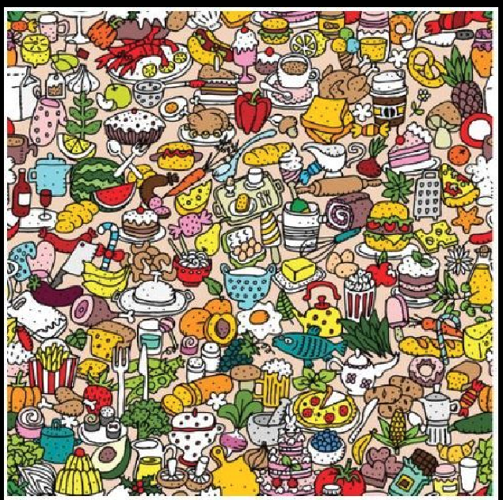
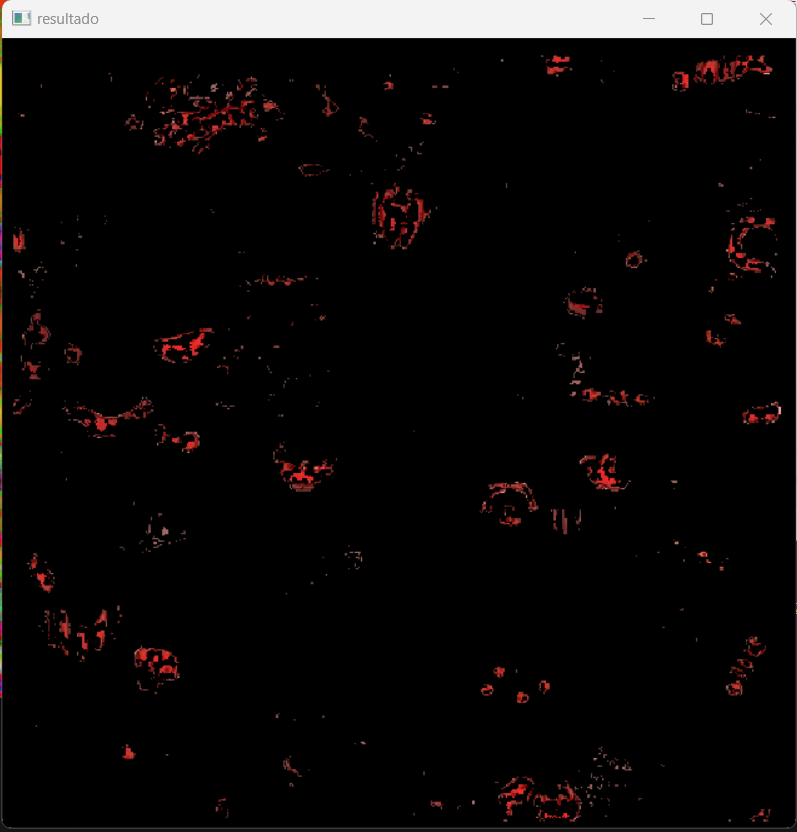

# Ensayo sobre la Introspección y el Algoritmo de Identificación de Colores en Imágenes

## Por: Calderón Piña Carlos Michell

### Introducción

La introspección, una práctica que nos invita a "mirar en el interior", encuentra un fascinante paralelo con el mundo de la inteligencia artificial y el procesamiento de imágenes. En este ensayo, exploraremos la conexión entre la introspección y un algoritmo específico diseñado para identificar y contar elementos de un color particular en una imagen. Este ejercicio refleja la capacidad de la introspección para inspirar soluciones creativas y pragmáticas en el ámbito de la inteligencia artificial.

La Analogía con la Introspección
La introspección, en términos generales, implica la capacidad de un individuo para observarse y analizarse a sí mismo, interpretando y caracterizando sus propios procesos cognitivos y emotivos. Al mirar hacia adentro, se busca comprender la complejidad interna de la mente humana. En este contexto, podemos asimilar la introspección con la tarea de observar y comprender una imagen, específicamente aquellas llenas de colores y formas.

Resolución del Problema: Identificación de Colores en Imágenes
El problema propuesto consiste en contar los elementos que tienen el color rojo en una imagen compleja. Para abordar esta tarea, se ha desarrollado un algoritmo en Python utilizando la biblioteca OpenCV. Este algoritmo sigue un enfoque basado en el modelo de espacio de color HSV (matiz, saturación, valor), que es particularmente efectivo para trabajar con colores en imágenes.

Explicación del Código
El código proporcionado utiliza OpenCV para realizar la identificación de elementos rojos en una imagen. A continuación, se presenta una explicación detallada del código:

```Python
import cv2 as cv
import numpy as np

# Despues de importar las librerias correspondientes vamos a cargar la imagen 
img = cv.imread('C:/Users/carlo/Documents/TEC/Semestre 8/Inteligencia Artificial/ActividadesIA/Identificar_coordenadasRY/tr.png', 1)

# Convertimos la imagen a RGB, con la libreria de OpenCV carga la imagen en formato BGR por defecto
img2 = cv.cvtColor(img, cv.COLOR_BGR2RGB)

# Convertimos la imagen a espacio de color HSV
img3 = cv.cvtColor(img2, cv.COLOR_RGB2HSV)

# Definimos umbrales para identificar el color rojo en ambos rangos
umbralBajo = (0, 85, 85)
umbralAlto = (5, 255, 255)
umbralBajoB = (0, 85, 85)
umbralAltoB = (5, 255, 255)

# Creamos máscaras para cada rango de rojo
mascara1 = cv.inRange(img3, umbralBajo, umbralAlto)
mascara2 = cv.inRange(img3, umbralBajoB, umbralAltoB)

# Combinamos las máscaras
mascara = mascara1 + mascara2

# Aplicamos la máscara a la imagen original
resultado = cv.bitwise_and(img, img, mask=mascara)

# Mostramos las imágenes resultantes, las cuales en este caso son 5 las imagenes resultantes
cv.imshow('resultado', resultado)
cv.imshow('mascara', mascara)
cv.imshow('img',img)
cv.imshow('img2', img2)
cv.imshow('img3', img3)

cv.waitKey(0)
cv.destroyAllWindows()
```

Como implementamos esta libreria de open cv

Si bien sabemos que al usar la biblioteca OpenCV en Python para resolver el problema de identificación y conteo de elementos de color rojo en una imagen, es importante seguir ciertos pasos para llevar a cabo la resolucion.

La cual es la siguiente imagen, esta evidentemente no esta procesada



__Cargar y Preprocesar la Imagen:__
La imagen se carga utilizando OpenCV y se convierte a formato RGB para asegurar una representación coherente de los colores.

__Convertir a Espacio de Color HSV:__
La imagen en formato RGB se transforma al espacio de color HSV, una representación que facilita la identificación de colores específicos, debido a que pueden tener mayor o menor saturacion, cosa que es mas facil de detectar en HSV.

__Definir Umbrales para el Color Rojo:__
Se establecen umbrales en el espacio de color HSV para determinar el rango de colores que serán considerados como "rojos" evidentemente para saber identificar estos umbrales se puede usar alguna imagen donde esta especificada por rangos estos colores.

__Crear Máscaras y Combinarlas:__
Se crean máscaras que resaltan las áreas de la imagen que caen dentro del rango de colores rojos definido anteriormente. Estas máscaras se combinan para obtener una máscara única que destaca todas las áreas rojas en la imagen.

__Aplicar la Máscara a la Imagen Original:__
La máscara se utiliza para aislar las áreas de interés de la imagen original, resaltando así los elementos de color rojo.

__Mostrar Imágenes Resultantes:__
Se visualizan varias imágenes en la interfaz de usuario, incluyendo la imagen original, la imagen en formato RGB, la imagen en espacio de color HSV, la máscara que destaca los elementos rojos y el resultado final que muestra únicamente los elementos rojos de la imagen original.

Este al correr el programa queda de la siguiente manera:



### Conclusion

Este ejercicio fusiona la introspección con la resolución de problemas en el ámbito de la inteligencia artificial. La capacidad de "mirar hacia adentro" se refleja en la creatividad de la solución propuesta para identificar colores en imágenes de los cuales los colores es importante mencionar que tiene un amplio espectro hay muchisimos tonos derivados, similares del rojo en este ejemplo. Este enfoque revela la sinergia entre la comprensión interna y la aplicación práctica, ilustrando cómo la introspección puede inspirar soluciones innovadoras en la era de la inteligencia artificial y el procesamiento de imágenes.
