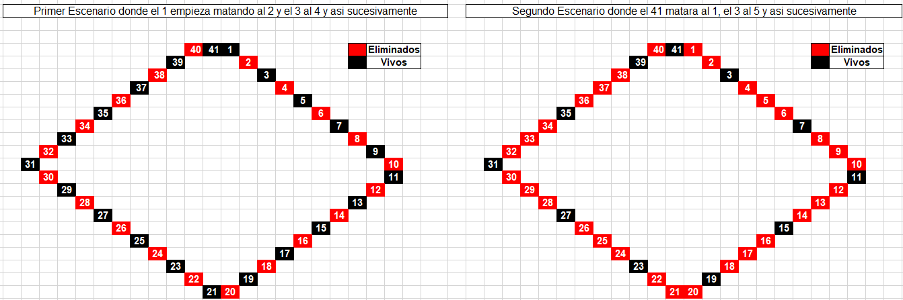
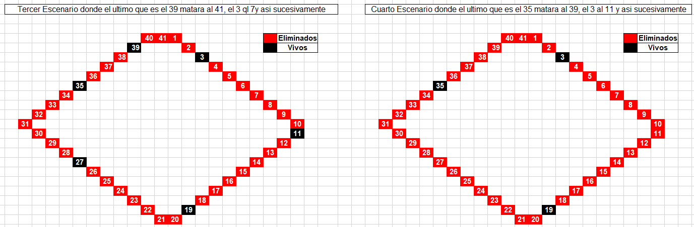
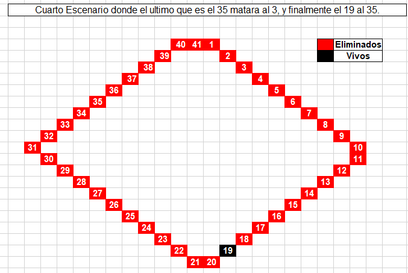

# Ensayo sobre la explicación y resolución del Problema de Josephus

## Por: Calderón Piña Carlos Michell

### Introducción

A lo largo de la historia el proceso de razonamiento, guiado por los principios de la lógica, representa uno de los aspectos fundamentales de la mente humana que ha sido objeto de estudio y reflexión.

La lógica, como disciplina filosófica y matemática, proporciona el marco conceptual mediante el cual evaluamos la validez y coherencia de nuestros pensamientos. Por consecuente en el presente ensayo se busca entrar a el fascinante mundo del razonamiento lógico, examinando cómo nuestras mentes emplean reglas y estructuras para llegar a conclusiones, argumentar de manera efectiva y discernir la verdad en medio de la complejidad del pensamiento humano.

Desde las bases de la lógica formal hasta su aplicación en la resolución de problemas cotidianos, el proceso de razonamiento según la lógica emerge como una herramienta crucial para la comprensión del mundo que nos rodea y la toma de decisiones informadas. A medida que nos adentramos en este análisis, revisaremos las ciertas conexiones entre premisas y conclusiones, reconociendo el papel esencial que desempeña la lógica en la construcción de argumentos sólidos y la navegación a través de las complejidades del pensamiento humano.

__Josephus, ... ¿Sobrevivirá?__

Como bien ya se explicó en las indicaciones del PDF, se sabe que son 41 personas entre ellas los soldados y Josephus, al igual que las reglas que empieza el que está sentado en la posición número 1. Ese soldado matará al 2. Luego, el 3 matará al 4, el 5 al 6. . . y así siguiendo.

Como usted advierte, llegará un momento en el que habrán muerto todos los que están sentados en las posiciones que llevan un número par. Pero cuando muera el último de ellos, el número 40 (a manos del 39), el 41 estará vivo aún y ahora, el que tiene sentado a la izquierda es el número 1 quien había empezado con los asesinatos. De acuerdo con las reglas, el 41 matará al 1, el 3 matará al 5, etc.

si bien esto puede llegar a ser confuso primero podríamos tratar de entenderlo con una tabla donde vayamos depurando las posiciones hasta tal vez llegar a la posición ganadora, que al menos esto realizado de forma empírica se tienen 5 distintos escenarios en los cuales se podría llegar a la conclusión de que, si empezamos con el número 1, y si nos sentamos en la posición 19 se supone que aun quedaríamos con vida, a continuación, las imágenes.



Como se puede observar en esta imagen se presentan 2 casos, los cuales los describe inicialmente en el PDF. Si seguimos con esta secuencia se verá así... como en la siguiente imagen.



Ahora cada vez más podemos observar que solo quedan 3 lugares, y en la siguiente imagen existe un aparente ganador.



Como se observa se puede deducir que si estas en la posición 19 y empieza el numero 1 a matar podrías quedar vivo... Pero ¿cuál es el sustento matemático?

A continuación, se explicará la posible solución.

Tomemos el caso donde n=41. El número más cercano y menor a 41 que es una potencia de 2 elevado a la 5 es 32. La diferencia es 41−32=9. Por lo tanto, la posición ganadora es 2×9+1=19. Así, Josephus se sentaría en la posición 19 para sobrevivir en este posible escenario.

Claro al hacerlo de esta forma empírica de prueba y error solo estaríamos perdiendo el tiempo hasta que encontremos la correcta, por consecuente es mejor usar la lógica matemática para resolverlo, entonces podemos empezar a resolverlo con la siguiente formula ya que el planteamiento anterior no siempre puede funcionar.

A continuación, el código que resuelve el problema, y no solo de 41 soldados si no que el número de soldados que se deseen colocar.

```Python
import math

def encontrar_mayor_potencia_dos(numero):
    # Calcula el logaritmo en base 2 del número para encontrar el exponente
    exponente = int(math.log(numero, 2))
    
    # Calcula 2 elevado a ese exponente para obtener la mayor potencia de 2
    potencia_dos = 2 ** exponente
    return potencia_dos

# Pide al usuario ingresar el número de soldados
numero_soldados = int(input("Digita la cantidad de soldados: "))

# Encuentra la mayor potencia de 2 menor o igual al número de soldados
mayor_potencia_dos = encontrar_mayor_potencia_dos(numero_soldados)

# Aplica la fórmula matemática para determinar la posición de Josephus
posicion_josephus = 1 + (numero_soldados - mayor_potencia_dos) * 2 % numero_soldados

# Imprime la posición calculada de Josephus
print(f"Josephus se sentó en la posición número {posicion_josephus}")
```

Entonces recapitulando en la primera función se toma un número y calcula la mayor potencia de 2 menor o igual a ese número utilizando el logaritmo en base 2 y la operación de exponenciación.

### Conclusión

El estudio del proceso de razonamiento bajo los principios de la lógica revela la profunda influencia que este desempeña en la capacidad humana para pensar, resolver problemas y tomar decisiones informadas. La lógica, como disciplina fundamental, proporciona un marco conceptual que trasciende fronteras disciplinarias, influyendo en áreas que van desde la filosofía y las matemáticas hasta la ciencia de la computación y la toma de decisiones cotidiana. Desde las estructuras lógicas formales hasta la aplicación de razonamiento inductivo en la vida diaria, la lógica es esencial para evaluar la validez de argumentos, identificar patrones y llegar a conclusiones fundamentadas.
