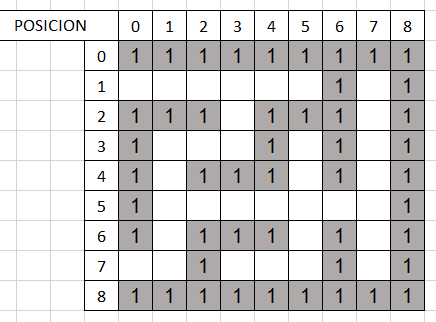
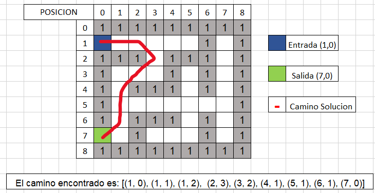

# ¿Que es la Heurística? Y ¿Como se podría resolver el problema del laberinto?

## Por: Calderón Piña Carlos Michell

### Introducción

La heurística, es una especie de "atajo mental" o regla práctica que utilizamos para tomar decisiones o resolver problemas de manera más rápida y eficiente. En lugar de seguir pasos lógicos y detallados, la heurística nos permite tomar decisiones basadas en experiencias pasadas, intuición o reglas generales que hemos aprendido.

Piensa en la heurística como un truco mental que te ayuda a simplificar situaciones complejas. Por ejemplo, cuando intentas encontrar un artículo en una tienda, puedes usar la heurística de ir directamente a la sección donde generalmente encuentras ese tipo de productos en lugar de revisar cada pasillo. Es como un atajo que te ayuda a tomar decisiones rápidas sin necesidad de un análisis exhaustivo.

Sin embargo, es importante destacar que, aunque las heurísticas pueden ser útiles y eficientes, a veces también pueden llevar a errores porque simplifican la información y pueden no ser aplicables en todas las situaciones. En resumen, la heurística es una herramienta mental que usamos para tomar decisiones más rápidas, pero también debemos ser conscientes de sus limitaciones.

### ¿Cuál es su papel en la resolución de problemas?

Es importante mencionar que, aunque las heurísticas son herramientas valiosas, también tienen limitaciones. Pueden conducir a sesgos y errores cuando se aplican en contextos inapropiados. Por consecuente, es esencial combinar la heurística con el pensamiento crítico y estar consciente de las circunstancias en las que puede ser más o menos efectiva.

Pensemos en las heurísticas como trucos mentales o atajos que te ayudan a resolver problemas más fácilmente. En lugar de perder tiempo revisando todas las opciones y detalles, las heurísticas te permiten tomar decisiones rápidas basadas en reglas prácticas o en tu instinto.

Cuando tienes que decidir algo rápido, las heurísticas son como tus superpoderes para tomar decisiones rápidas. Te ayudan a evitar pensar demasiado y te permiten llegar a soluciones aceptables de manera rápida, especialmente cuando el tiempo es importante.

Imaginemos que tu cerebro es como una computadora y tiene recursos limitados. Las heurísticas son como programas que hacen que tu cerebro funcione de manera más eficiente al simplificar las decisiones. Esto es muy útil cuando enfrentas problemas complicados y necesitas que tu mente use sus recursos de manera inteligente.

Cuando la información no es clara o no tienes todos los detalles, las heurísticas son como mapas que te guían en la dirección correcta. Aunque no garantizan la mejor solución, te dan pistas prácticas para seguir adelante.

Además, las heurísticas se basan en tus experiencias y en lo que has aprendido en el pasado. Son como reglas prácticas que desarrollas a medida que enfrentas problemas una y otra vez. Así, te vuelves más rápido y eficiente para resolver situaciones similares.

Bien ahora que sabemos cuál es su principal papel podemos describir que algoritmo usar.

### A*

El algoritmo A* (A estrella) es un algoritmo de búsqueda informada que se utiliza comúnmente para encontrar el camino más corto desde un punto de inicio hasta un punto de destino en un grafo ponderado, como un mapa o un laberinto. Este algoritmo combina las características de búsqueda exhaustiva y heurística para ser eficiente y encontrar soluciones óptimas.

__Inicialización:__

* Se crea una estructura de datos llamada cola de prioridad, que organiza los nodos según su costo total estimado (la suma del costo real desde el inicio y una heurística estimada hasta el destino).
Se asignan valores iniciales para el nodo de inicio, y la cola de prioridad se inicializa con este nodo.

__Bucle Principal:__

* Mientras la cola de prioridad no esté vacía, el algoritmo sigue explorando nodos.
En cada iteración, se extrae el nodo con el menor costo total estimado de la cola de prioridad.

__Exploración de Vecinos:__

* Se exploran los vecinos del nodo actual. Para cada vecino, se calcula el costo real desde el inicio y el costo total estimado sumando este costo real y una heurística estimada hasta el destino.

__Actualización de Información:__

* Si el nodo vecino no ha sido visitado o si se ha encontrado un camino más corto, se actualizan los valores asociados con ese nodo (costo real, costo total estimado y antecesor).
Terminación:

Cuando se llega al nodo de destino, se reconstruye el camino desde el inicio hasta el destino utilizando la información almacenada en los antecesores.

Ahora que sabemos que es y cómo funciona el algoritmo vamos a resolver dicho laberinto el cual es el que se muestra en la siguiente imagen.



Este laberinto como podemos observar en la posición (1,0) está ubicada la entrada y en la (7,0) la salida, por consecuente en base al algoritmo debemos resolverlo, sin embargo, se podría decir que a simple vista se puede resolver, entonces ahora en la siguiente imagen se puede apreciar cual es la solución del laberinto con el costo menor posible, este se puede apreciar con una línea roja.



Ahora que se identificó cual es el camino con menos costo vamos a programar una solución la cual debe también considerar las diagonales ya que es un camino valido por el cual tiene un costo menor.

1. Como primer paso vamos a Importar de Bibliotecas necesarias.

```Python
import math
#  Se usa math para poder utilizar la función sqrt en la heurística.
```

2. Vamos a definir la función Heurística:

```Python
def heuristica(a, b):
    return math.sqrt((b[0] - a[0]) ** 2 + (b[1] - a[1]) ** 2)
# Esta función calcula la distancia euclidiana entre dos puntos a y b. En este contexto, se utiliza como una estimación heurística para guiar la búsqueda.
```

3. Definición de Movimientos y Función A:*

```Python
movimientos = [(-1, 0), (1, 0), (0, -1), (0, 1), (-1, -1), (-1, 1), (1, -1), (1, 1)] 
# Aquí se definen los movimientos posibles (arriba, abajo, izquierda, derecha, diagonales) y la función principal de búsqueda A*.

def a_estrella(laberinto, inicio, fin):
    # Código de la función... 
```

4. Inicializamos las variables:

```Python
cola_prioridad = [(0, inicio)]
antecesores = {inicio: None}
g_score = {inicio: 0}
# Estas variables se utilizan para llevar a cabo el algoritmo A* y realizar un seguimiento de los nodos visitados y sus costos acumulados.
```

5. Bucle Principal de A:*

```Python
while cola_prioridad:
    # Este bucle se ejecuta mientras haya nodos en la cola de prioridad. Cada iteración del bucle extiende la búsqueda hacia el nodo con el menor costo acumulado.
```

6. Obtención del Camino y Retorno:

```Python
if actual == fin:
    camino = [actual]
    while actual := antecesores[actual]:
        camino.append(actual)
    return camino[::-1]
# Cuando se alcanza el nodo de destino (fin), se reconstruye el camino desde el nodo final hasta el nodo inicial utilizando los antecesores.
```

7. Exploración de Vecinos y Actualización de Información:

```Python
for movimiento in movimientos:
    nueva_posicion = (actual[0] + movimiento[0], actual[1] + movimiento[1])
    # Se exploran los vecinos del nodo actual, y se actualizan los costos acumulados y antecesores si se encuentra un camino más corto.
```

8. Se imprimen los resultados:

```Python
camino_solucion = a_estrella(laberinto, inicio, fin)

if camino_solucion:
    # Código de impresión...
else:
    print("No hay solución.")
```

#### En conclusión

La resolución de laberintos mediante métodos heurísticos, específicamente el algoritmo A*, realmente es una muy buena herramienta en el ámbito de la inteligencia artificial. La combinación de una función heurística que guía la búsqueda y una estrategia de exploración eficiente, permite encontrar el camino óptimo de manera rápida y precisa.

A* se destaca por su capacidad para encontrar soluciones efectivas en términos de distancia y eficiencia de búsqueda. La heurística, al proporcionar una estimación informada de los costos, permite al algoritmo dirigir sus esfuerzos hacia las áreas más prometedoras del espacio de búsqueda. Este enfoque no solo mejora la velocidad de convergencia, sino que también garantiza soluciones óptimas en muchos casos.

La implementación de A* para la resolución de laberintos no solo ha demostrado ser efectiva, sino también versátil. Puede adaptarse a diferentes configuraciones y dimensiones de laberintos, proporcionando soluciones eficientes incluso en entornos complejos. Además, su capacidad para gestionar obstáculos y encontrar el camino más corto lo convierte en una opción valiosa en aplicaciones prácticas, como la planificación de rutas en logística.
