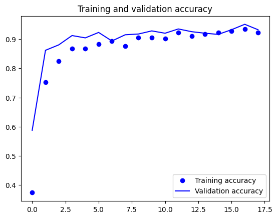
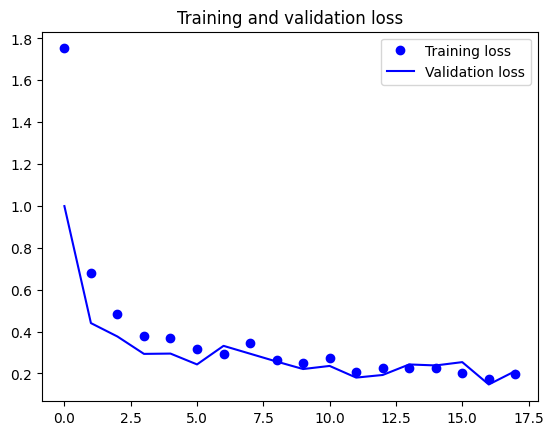
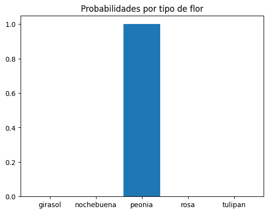
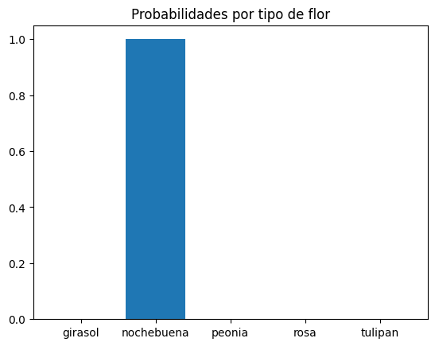
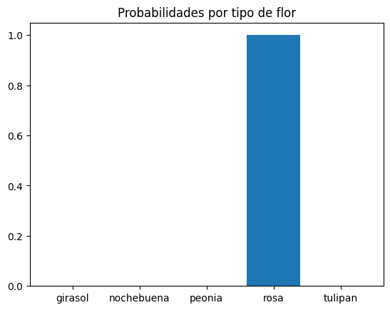
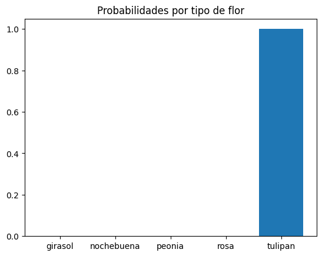
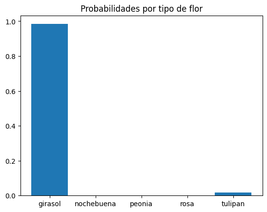

# Creación de una CNN de 5 flores distintas, colores distintos y tamaños distintos

## Por: Calderón Piña Carlos Michell

### Instrucciones

1. Genera un CNN de 5 flores distintas, colores distintos y tamaños distintos, puntos a evaluar:

    * Herramienta para generar el DataSet.
    * Archivo de conocimiento después del entrenamiento.
    * Precisión de los resultados.
    * Implementar el modelo en un vídeo o imagen.

### Flores seleccionadas para la detección del programa

* __Peonia rosa:__ La peonía o paeony es una planta con flores del género Paeonia, el único género de la familia Paeoniaceae. Las peonías son originarias de Asia, Europa y el oeste de América del Norte.

* __Tulipán naranja:__ Tulipa es un género de plantas perennes y bulbosas perteneciente a la familia Liliaceae, en el que se incluyen los populares tulipanes, nombre común con el que se designa a todas las especies, híbridos y cultivares de este género.
  
* __Rosa Azul:__ El género Rosa está compuesto por un conocido grupo de arbustos generalmente espinosos y floridos representantes principales de la familia de las rosáceas. Se denomina rosa a la flor de los miembros de este género y rosal a la planta.
  
* __Girasol Amarillo:__ Helianthus annuus, también llamado comúnmente girasol, mirasol, maravilla, maíz de teja, acahual es una planta herbácea anual de la familia de las asteráceas originaria de Centro y Norteamérica y cultivada como alimenticia, oleaginosa y ornamental en todo el mundo.
  
* __Nochebuena:__ Euphorbia pulcherrima, conocida comúnmente como flor de pascua, flor de Nochebuena, flor de Navidad o Cuetlaxochitl, entre otros nombres, es una especie de la familia Euphorbiaceae nativa de México.

Bien ahora que ya elegimos los 5 tipos de flores distintas proseguimos a descargarlas, pero no una por una, claro usaremos una herramienta para ello, entonces, así como se observa en el siguiente código al usar las librerías de descarga de Google podremos descargarlas y hasta crear variaciones de dicha imagen esto con la finalidad de nuestro DataSet sea mayor y más preciso.

```Python
# Importa las bibliotecas necesarias
from google_images_download import google_images_download
import cv2
import os
import numpy as np

# Función para hacer el fondo de una imagen transparente
def make_background_transparent(image, threshold=0):
    # Convierte la imagen a formato BGRA (BGR con canal de transparencia)
    rgba_image = cv2.cvtColor(image, cv2.COLOR_BGR2BGRA)
    
    # Identifica píxeles negros y los hace transparentes
    black_pixels = np.all(rgba_image[:, :, :3] <= threshold, axis=2)
    rgba_image[black_pixels, 3] = 0
    
    return rgba_image

# Función principal para descargar y transformar imágenes
def download_and_transform_images(query, total_images, download_path):
    # Crea una instancia del objeto google_images_download
    response = google_images_download.googleimagesdownload()
    
    # Define los argumentos para la descarga de imágenes
    arguments = {"keywords": query, "limit": total_images, "output_directory": download_path, "image_directory": query, "format": "jpg"}

    try:
        # Intenta descargar imágenes con los argumentos dados
        paths = response.download(arguments)
    except Exception as e:
        # Maneja errores durante la descarga
        print(f"Error al descargar imágenes: {e}")
        return
    
    # Crea una carpeta para almacenar las imágenes transformadas
    transformed_folder_path = os.path.join(download_path, query, 'dataTransformed')
    os.makedirs(transformed_folder_path, exist_ok=True)

    # Obtiene la ruta de la carpeta de imágenes originales
    original_folder_path = os.path.join(download_path, query)
    
    # Verifica si la carpeta de imágenes originales existe
    if not os.path.exists(original_folder_path):
        print("No se encontró la carpeta de descarga. Es posible que no se hayan descargado imágenes.")
        return

    # Itera sobre los archivos en la carpeta de imágenes originales
    for filename in os.listdir(original_folder_path):
        if filename.endswith('.jpg'):
            original_image_path = os.path.join(original_folder_path, filename)
            try:
                # Lee la imagen original
                original_image = cv2.imread(original_image_path)
                if original_image is None:
                    print(f"No se pudo cargar la imagen: {filename}")
                    continue

                # Redimensiona la imagen original a 200x200 y guarda la variante
                resized_original_image = cv2.resize(original_image, (200, 200))
                original_variant_filename = f"{os.path.splitext(filename)[0]}_{query}_original.png"
                resized_original_path = os.path.join(transformed_folder_path, original_variant_filename)
                cv2.imwrite(resized_original_path, resized_original_image)

                # Crea variantes  distintas de la imagen
                for i in range(10):
                    variant_image = resized_original_image.copy()
                    angle = np.random.randint(0, 360)
                    rotation_matrix = cv2.getRotationMatrix2D((150, 150), angle, 1)
                    variant_image = cv2.warpAffine(variant_image, rotation_matrix, (200, 200), borderMode=cv2.BORDER_CONSTANT)
                    variant_image = make_background_transparent(variant_image)

                    # Guarda la variante de la imagen
                    variant_filename = f"{os.path.splitext(filename)[0]}_{query}_variant_{i}.png"
                    variant_path = os.path.join(transformed_folder_path, variant_filename)
                    cv2.imwrite(variant_path, variant_image)
            except Exception as e:
                print(f"Error al procesar la imagen {filename}: {e}")
    print("Descarga y variaciones completadas.")

# Uso de la función con un ejemplo específico
download_and_transform_images('Flor_nochebuena', 50, 'C:/Users/carlo/Documents/TEC/Semestre 8/Inteligencia Artificial/ActividadesIA/ProyFin1Flores/dataSetFlores/nochebuena')
```

Una vez realizado el DataSet de cada tipo de flor vamos a revisar que estén bien ordenadas las carpetas adentro de otra que le llamaremos Train, y se reconozca fácilmente, como se dijo en el video de la explicación la herramienta que utilicé para ejecutar todos los códigos de Python fue en Google Colab la cual es muy buena, rápida e intuitiva para este tipo de proyectos además de que se usan los recursos de un servidor, no los de la maquina local en el cual se programan.

Una vez dicho eso vamos a crear el modelo el cual en las instrucciones se solicitó como h5py sin embargo al momento de crearlo ocurrió un error para guardar en ese formato por consecuente se guardó en keras, cosa que no impidió el funcionamiento de este.

```Python
from google.colab import drive
import os
import re
import numpy as np
import h5py
import matplotlib.pyplot as plt
from sklearn.model_selection import train_test_split
from sklearn.preprocessing import LabelEncoder
from sklearn.metrics import precision_recall_fscore_support
from tensorflow.keras.utils import to_categorical
from tensorflow.keras.preprocessing.image import img_to_array, load_img
from tensorflow.keras.callbacks import EarlyStopping
from tensorflow.keras.optimizers import Adam
from tensorflow.keras.models import Sequential
from tensorflow.keras.layers import Conv2D, MaxPooling2D, Flatten, Dense, Dropout
from tensorflow.keras.preprocessing.image import ImageDataGenerator

# Montar la unidad de Google Drive
drive.mount('/content/drive')

# Directorio en Google Drive donde están tus datos
drive_dir = '/content/drive/MyDrive/dataSetFlores/Train'

images = []
labels = []

# Tamaño al que se redimensionarán las imágenes
target_size = (200, 200)

# Recorrer las carpetas de entrenamiento
for class_folder in os.listdir(drive_dir):
    class_path = os.path.join(drive_dir, class_folder)

    if os.path.isdir(class_path):
        print(f"Leyendo imágenes de la carpeta de entrenamiento {class_folder}")

        for filename in os.listdir(class_path):
            if re.search(r"\.(jpg|jpeg|png|bmp|tiff)$", filename):
                filepath = os.path.join(class_path, filename)

                try:
                    # Redimensionar y cargar la imagen
                    image = load_img(filepath, target_size=target_size)
                    image_array = img_to_array(image)

                    images.append(image_array)
                    labels.append(class_folder)
                except Exception as e:
                    print(f"Error al procesar la imagen {filepath}: {str(e)}")

# Convertir a numpy array
images = np.array(images)
labels = np.array(labels)

# Convertir etiquetas a valores numéricos
label_encoder = LabelEncoder()
labels_encoded = label_encoder.fit_transform(labels)

# Dividir datos de entrenamiento en conjuntos de entrenamiento y validación
train_X, val_X, train_Y, val_Y = train_test_split(images, labels_encoded, test_size=0.2, random_state=42)

# Normalizar datos de imagen
train_X = train_X.astype('float32') / 255.0
val_X = val_X.astype('float32') / 255.0

# Convertir etiquetas a one-hot encoding
train_Y_one_hot = to_categorical(train_Y)
val_Y_one_hot = to_categorical(val_Y)

# Crear un archivo HDF5 para almacenar los datos
hdf5_file = h5py.File('/content/drive/MyDrive/dataSetFlores/data.h5', 'w')
hdf5_file.create_dataset('train_X', data=train_X)
hdf5_file.create_dataset('train_Y', data=train_Y_one_hot)
hdf5_file.create_dataset('val_X', data=val_X)
hdf5_file.create_dataset('val_Y', data=val_Y_one_hot)
hdf5_file.close()

# Construir el modelo
model = Sequential()
model.add(Conv2D(16, kernel_size=(3, 3), activation='relu', input_shape=(200, 200, 3)))
model.add(MaxPooling2D(pool_size=(2, 2)))
model.add(Dropout(0.25))
model.add(Conv2D(32, kernel_size=(3, 3), activation='relu'))
model.add(MaxPooling2D(pool_size=(2, 2)))
model.add(Dropout(0.25))
model.add(Conv2D(64, kernel_size=(3, 3), activation='relu'))
model.add(MaxPooling2D(pool_size=(2, 2)))
model.add(Dropout(0.25))
model.add(Flatten())
model.add(Dense(256, activation='relu'))
model.add(Dropout(0.5))
model.add(Dense(len(np.unique(labels)), activation='softmax'))

# Compilar el modelo
model.compile(loss='categorical_crossentropy', optimizer=Adam(learning_rate=0.001), metrics=['accuracy'])

# Aumento de datos
datagen = ImageDataGenerator(
    rotation_range=40,
    width_shift_range=0.2,
    height_shift_range=0.2,
    shear_range=0.2,
    zoom_range=0.2,
    horizontal_flip=True,
    fill_mode='nearest'
)

datagen.fit(train_X)

# Parada anticipada
early_stop = EarlyStopping(monitor='val_loss', patience=5, restore_best_weights=True)

# Entrenar el modelo
history = model.fit(datagen.flow(train_X, train_Y_one_hot, batch_size=64),
                    epochs=18,
                    validation_data=(val_X, val_Y_one_hot),
                    callbacks=[early_stop])

# Obtener precisión, recuperación y puntuación F1
precision, recall, f1, _ = precision_recall_fscore_support(np.argmax(val_Y_one_hot, axis=1),
                                                           np.argmax(model.predict(val_X), axis=1),
                                                           average='weighted')

print(f'Validation Precision: {precision:.4f}')
print(f'Validation Recall: {recall:.4f}')
print(f'Validation F1 Score: {f1:.4f}')

# Guardar el modelo en el archivo HDF5
model.save("/content/drive/MyDrive/dataSetFlores/modelFlores.h5")

# Obtener métricas adicionales
accuracy = history.history['accuracy']
val_accuracy = history.history['val_accuracy']
loss = history.history['loss']
val_loss = history.history['val_loss']
epochs = range(len(accuracy))

# Plot de la precisión
plt.plot(epochs, accuracy, 'bo', label='Training accuracy')
plt.plot(epochs, val_accuracy, 'b', label='Validation accuracy')
plt.title('Training and validation accuracy')
plt.legend()
plt.figure()

# Plot de la pérdida
plt.plot(epochs, loss, 'bo', label='Training loss')
plt.plot(epochs, val_loss, 'b', label='Validation loss')
plt.title('Training and validation loss')
plt.legend()
plt.show()

```

```Python
Mounted at /content/drive
Leyendo imágenes de la carpeta de entrenamiento rosa
Leyendo imágenes de la carpeta de entrenamiento nochebuena
Leyendo imágenes de la carpeta de entrenamiento tulipan
Error al procesar la imagen /content/drive/MyDrive/dataSetFlores/Train/tulipan/Image_19.jpg: broken data stream when reading image file
Leyendo imágenes de la carpeta de entrenamiento peonia
Leyendo imágenes de la carpeta de entrenamiento girasol
Epoch 1/18
47/47 [==============================] - 162s 3s/step - loss: 1.7519 - accuracy: 0.3738 - val_loss: 0.9991 - val_accuracy: 0.5878
Epoch 2/18
47/47 [==============================] - 171s 4s/step - loss: 0.6802 - accuracy: 0.7530 - val_loss: 0.4404 - val_accuracy: 0.8617
Epoch 3/18
47/47 [==============================] - 180s 4s/step - loss: 0.4828 - accuracy: 0.8249 - val_loss: 0.3763 - val_accuracy: 0.8803
Epoch 4/18
47/47 [==============================] - 162s 3s/step - loss: 0.3792 - accuracy: 0.8668 - val_loss: 0.2933 - val_accuracy: 0.9122
Epoch 5/18
47/47 [==============================] - 180s 4s/step - loss: 0.3683 - accuracy: 0.8682 - val_loss: 0.2948 - val_accuracy: 0.9043
Epoch 6/18
47/47 [==============================] - 183s 4s/step - loss: 0.3174 - accuracy: 0.8825 - val_loss: 0.2430 - val_accuracy: 0.9229
Epoch 7/18
47/47 [==============================] - 163s 3s/step - loss: 0.2918 - accuracy: 0.8935 - val_loss: 0.3317 - val_accuracy: 0.8936
Epoch 8/18
47/47 [==============================] - 165s 4s/step - loss: 0.3449 - accuracy: 0.8762 - val_loss: 0.2942 - val_accuracy: 0.9149
Epoch 9/18
47/47 [==============================] - 161s 3s/step - loss: 0.2642 - accuracy: 0.9058 - val_loss: 0.2567 - val_accuracy: 0.9176
Epoch 10/18
47/47 [==============================] - 164s 3s/step - loss: 0.2510 - accuracy: 0.9045 - val_loss: 0.2209 - val_accuracy: 0.9282
Epoch 11/18
47/47 [==============================] - 161s 3s/step - loss: 0.2726 - accuracy: 0.9018 - val_loss: 0.2358 - val_accuracy: 0.9202
Epoch 12/18
47/47 [==============================] - 161s 3s/step - loss: 0.2073 - accuracy: 0.9224 - val_loss: 0.1801 - val_accuracy: 0.9348
Epoch 13/18
47/47 [==============================] - 171s 4s/step - loss: 0.2249 - accuracy: 0.9108 - val_loss: 0.1926 - val_accuracy: 0.9255
Epoch 14/18
47/47 [==============================] - 161s 3s/step - loss: 0.2275 - accuracy: 0.9164 - val_loss: 0.2429 - val_accuracy: 0.9202
Epoch 15/18
47/47 [==============================] - 167s 4s/step - loss: 0.2269 - accuracy: 0.9218 - val_loss: 0.2381 - val_accuracy: 0.9162
Epoch 16/18
47/47 [==============================] - 161s 3s/step - loss: 0.2002 - accuracy: 0.9274 - val_loss: 0.2540 - val_accuracy: 0.9322
Epoch 17/18
47/47 [==============================] - 165s 3s/step - loss: 0.1716 - accuracy: 0.9338 - val_loss: 0.1472 - val_accuracy: 0.9508
Epoch 18/18
47/47 [==============================] - 165s 3s/step - loss: 0.1961 - accuracy: 0.9221 - val_loss: 0.2113 - val_accuracy: 0.9322
24/24 [==============================] - 7s 290ms/step
Validation Precision: 0.9361
Validation Recall: 0.9322
Validation F1 Score: 0.9323
/usr/local/lib/python3.10/dist-packages/keras/src/engine/training.py:3103: UserWarning: You are saving your model as an HDF5 file via `model.save()`. This file format is considered legacy. We recommend using instead the native Keras format, e.g. `model.save('my_model.keras')`.
  saving_api.save_model(modelo_flores1.keras )
```

Ahora vermeos las graficas que nos arroja:





Ya explicado el código en el video lo que nos queda es probar el modelo ya realizado, por consecuente veremos si funciona correctamente o hay que agregarle más fotos al DataSet, en mi caso solo hizo falta agregarles más fotos a los tulipanes naranjas ya que de estas casi no encontré muchas fotos al inicio, y todas las demás llegaron a casi 1000 imágenes de DataSet.

Ahora veremos cómo es que funciona la ejecución del modelo.

```Python
import os
import h5py
import numpy as np
from tensorflow.keras.models import load_model
from tensorflow.keras.preprocessing import image
import matplotlib.pyplot as plt

# Directorio donde se encuentra el modelo original en Google Drive
modelo_original_ruta = '/content/drive/MyDrive/dataSetFlores/Test/modelo_flores1.keras'

# Cargar el modelo original desde el archivo HDF5
with h5py.File(modelo_original_ruta, 'r') as model_file:
    modelo_original = load_model(model_file)

# Directorio donde se encuentran las nuevas imágenes de prueba en Google Drive
directorio_base = '/content/drive/MyDrive/dataSetFlores/PruebaParaCalar'

# Diccionario de mapeo de clases a índices
mapeo_clases_a_indices = {'girasol': 0, 'nochebuena': 1, 'peonia': 2, 'rosa': 3, 'tulipan': 4}

# Invertir el diccionario para obtener un mapeo de índices a nombres de clases
mapeo_indices_a_clases = {v: k for k, v in mapeo_clases_a_indices.items()}

# Recorrer todas las subcarpetas y archivos en el directorio base
for subdir, _, files in os.walk(directorio_base):
    for image_file in files:
        # Cargar la imagen y preprocesarla con el tamaño correcto
        img_path = os.path.join(subdir, image_file)
        img = image.load_img(img_path, target_size=(200, 200))
        img_array = image.img_to_array(img)
        img_array = np.expand_dims(img_array, axis=0)
        img_array /= 255.0  # Normalizar la imagen

        # Realizar la predicción con el modelo
        predicciones_original = modelo_original.predict(img_array)

        # Imprimir resultados
        print(f'Archivo: {img_path}')
        print(f'Flor predicha: {mapeo_indices_a_clases[np.argmax(predicciones_original[0])]}')
        print(f'Probabilidades:', predicciones_original[0])
        print('\n')

        # Graficar las métricas
        plt.bar(mapeo_clases_a_indices.keys(), predicciones_original[0])
        plt.title('Probabilidades por tipo de flor')
        plt.show()

```

Una vez que lo hayamos ejecutado se tardara aproximadamente 10 segundos, posteriormente a eso nos dara los resultados asi como se muestra a acontinuacion.

```Python
1/1 [==============================] - 0s 103ms/step
Archivo: /content/drive/MyDrive/dataSetFlores/PruebaParaCalar/images (4).jpeg
Flor predicha: peonia
Probabilidades: [1.09564084e-14 8.74601946e-10 9.99999881e-01 1.23712326e-07
 2.40794638e-08]
```



```Python
1/1 [==============================] - 0s 32ms/step
Archivo: /content/drive/MyDrive/dataSetFlores/PruebaParaCalar/images (6).jpeg
Flor predicha: nochebuena
Probabilidades: [0.0000000e+00 1.0000000e+00 2.3298455e-12 0.0000000e+00 7.3901798e-16]
```



```Python
1/1 [==============================] - 0s 31ms/step
Archivo: /content/drive/MyDrive/dataSetFlores/PruebaParaCalar/images (1).jpeg
Flor predicha: rosa
Probabilidades: [2.4331089e-11 4.2420913e-16 1.4844983e-11 1.0000000e+00 4.2067901e-13]
```



```Python
1/1 [==============================] - 0s 31ms/step
Archivo: /content/drive/MyDrive/dataSetFlores/PruebaParaCalar/519pX8EbNBL._AC_UF894,1000_QL80_.jpg
Flor predicha: tulipan
Probabilidades: [2.8920749e-06 1.8230228e-06 1.5344240e-07 2.4722671e-10 9.9999511e-01]
```



```Python
1/1 [==============================] - 0s 32ms/step
Archivo: /content/drive/MyDrive/dataSetFlores/PruebaParaCalar/IMG_6129_2-original.webp
Flor predicha: girasol
Probabilidades: [9.8368329e-01 1.2033908e-09 2.9153155e-08 1.1649078e-09 1.6316682e-02]
```



Y así es como finalmente terminamos con este proyecto, observamos que hay muy poca la coincidencia con otras flores que no son las identificadas.
