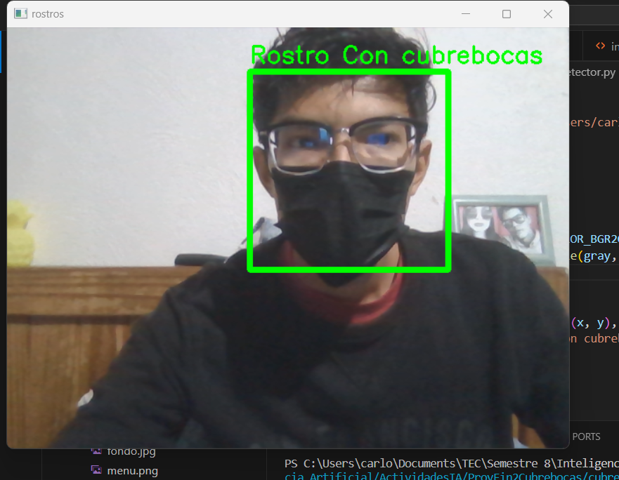
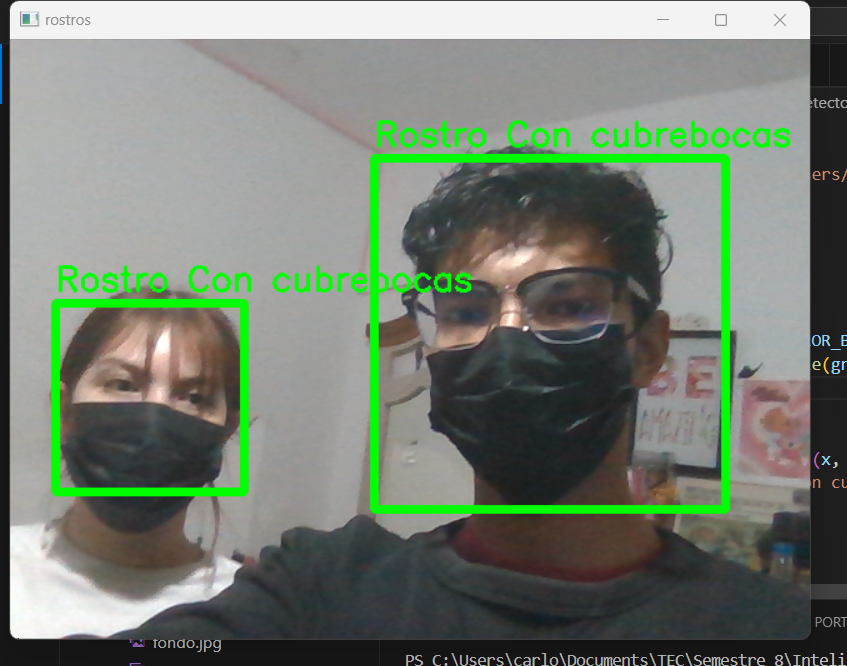

# Proyecto Final: 2-. Generar un dataset y haarcascade de caras con cubre bocas

## Por: Calderón Piña Carlos Michell

### Puntos a evaluar

* Herramientas para generar el Dataset.
  
* Proceso de creación del Dataset.
  
* Ajusten con el xml generado.
  
* Calidad del xml.

Entonces inicialmente vamos a crear el DataSet, para ello vamos a hacer uso de las librerias de openCV, y ademas de esto enseguida se mostrara el codigo con el cual se realizaron las capturas de las imagenes tanto positivas como negativas que fueron usadas para crear el xml.

```Python
import cv2 as cv

cap = cv.VideoCapture(0)
i = 0
while True:
    ret, frame = cap.read()
    frame = cv.rectangle(frame, (100,100), (400,400), (0,255,0), 2)
    cara = frame[100:400, 100:400] 
    frame3 = cv.resize(cara, (200,200))
    cv.imshow ('rostros', frame)
    cv.imshow('resize', frame3)
    cv.imshow ('cara', cara)

    k = cv.waitKey(1)
    if k == ord('s'):
        i=i+1
        cv.imwrite('C:/Users/carlo/Documents/TEC/Semestre 8/Inteligencia Artificial/ActividadesIA/ProyFin2Cubrebocas/ConCubrebocasPositivas/Positiva'+str(i)+'.jpg', frame3)
    if k == 27:
        break
cap.release()
cv.destroyAllWindows()

```

Como se puede observar creamos un recuadro en el cual se le dan los valores de alto y ancho, seguido de esto hacemos otro frame donde nos encuadre las cara, claro esto es opcional, sin embargo al tener de una mejor manera definida que es lo que vamos a capturar nos beneficia para tener un buen dataset. Es importante tambien mencionar el uso del resize, este es unicamente para cambiar el tamaño de la captura, y asi poder tener un dataset un tanto ligero.

Al igual que el codigo anterior se uso para la captura de las fotos negativas, unicamente en ese codigo se cambio el nombre y con la diferencia de que en dichas fotos no se uso cubrebocas, solo se uso cubrebocas para la creacion de las fotos positivas.

Importante saber: Una buena observacion que hago al desarrollar esto es que al menos yo cometi el error de tener mas fotos positivas que negativas, en ese caso, lo que hice fue tener un dataset de 1000 fotos con 10 tipos de cubrebocas de colores diferentes (Las cuales fueron las positivas), y tan solo 530 fotos negativas... Esto afecto mucho y retraso el desarrollo ya que al tratar de generar el xml con la herramienta cascade trainer gui, nos daba error, y esto nos podria traer problemas de falsos positivos.

Seguido de esto es importante que dependiendo el tamañano de dataset sera la presicion del detector, y menor sera el sesgo. en fin a continuacion se mostrara el codigo con el que se realizó el detector, es importante mencionar que se tenia como idea que tambien detectara el rostro sin que tuviera nada, precisasamente para que cuando si lo hubiera tambien lo detectara.

```Python
import cv2 as cv

# rostro_cascade = 'C:/Users/carlo/Documents/TEC/Semestre 8/Inteligencia Artificial/ActividadesIA/ProyFin2Cubrebocas/haarcascade_frontalface_alt.xml' 

rostro = cv.CascadeClassifier('C:/Users/carlo/Documents/TEC/Semestre 8/Inteligencia Artificial/ActividadesIA/ProyFin2Cubrebocas/DataSet/classifier/cascade.xml')
cap = cv.VideoCapture(0)
i=0
# font = cv.FONT_HERSHEY_SIMPLEX
while True:
    ret, frame = cap.read()
    i=i+1
    gray = cv.cvtColor(frame, cv.COLOR_BGR2GRAY)
    rostros = rostro.detectMultiScale(gray, scaleFactor=1.3, minNeighbors=30, minSize=(80, 80))
    for (x, y, w, h) in rostros:
        frame = cv.rectangle(frame, (x, y), (x + w, y + h), (0, 255, 0), 5)
        cv.putText(frame, 'Rostro Con cubrebocas', (x, y - 10), cv.FONT_HERSHEY_SIMPLEX, 0.9, (0, 255, 0), 2)
    cv.imshow('rostros', frame)
#   for (x, y, w, h) in rostros_totales:
#     frame = cv.rectangle(frame, (x, y), (x+w, y+h), (255, 0, 0), 5)
#     cv.putText(frame, 'Rostro Sin Cubrebocas', (x, y), font, 0.7, (0, 0, 255), 2)
    k = cv.waitKey(1)
    if k == ord('q'):
        break

cap.release()
cv.destroyAllWindows()

```

Es realmente sencillo en comparacion a la realizacion, produccion y procesamiento de las fotos del dataset.
Si bien especificamente en el codigo solo se jugo un poco con el seteo de los datos del rostro en rostro.detectMultiScale para que funcione lo mejor posible.

__Aqui un ejemplo de como se ve con una persona:__



__Aqui un ejemplo de como se ve con dos personas:__



Y asi es como se ve ya funcionando.
